# Weather Forecast Mobile Application

This project is a Weather Forecast mobile application developed using Flutter as a capstone project for the Mobile App Development course.  
The app provides current weather information and forecasts based on the user’s location or selected cities.

The main focus of the project was to use Flutter for cross-platform development and to integrate real backend services such as Firebase and a weather API.

---

## Project Features

- User registration and login using Firebase Authentication
- Account page with logout option
- GPS-based location detection with user permission
- Weather data fetched from Pirate Weather API
- Today’s weather information:
  - Temperature
  - Humidity
  - Wind speed
- Hourly forecast up to 23 hours ahead
- 7-day weather forecast
- Additional weather data:
  - UV index
  - Wind speed
  - Air pressure
  - Smoke intensity
- City search using text query
- Option to use current location or select a city manually

---

## Technologies Used

- Flutter (Dart)
- Firebase Authentication
- Pirate Weather REST API
- Geolocator (GPS permissions)
- Material Design
- Git for version control

---

## Screenshots

The application includes 12 screenshots showing the main features and UI.

All screenshots are located in the `screenshots` folder.

1. Login screen  
2. Login correctnes  
3. Registration screen 
4. Asking GPS Permisition 
5. Home screen 
6. Hourly forecast up to 24 hours  
7. Daily forecast and today UV index, wind speed, air pressure 
8. Account page
9. Home screen with another location
10. City selection screen
11. City selection search screen 
12. Choosen new city home screen info

Example usage:

| 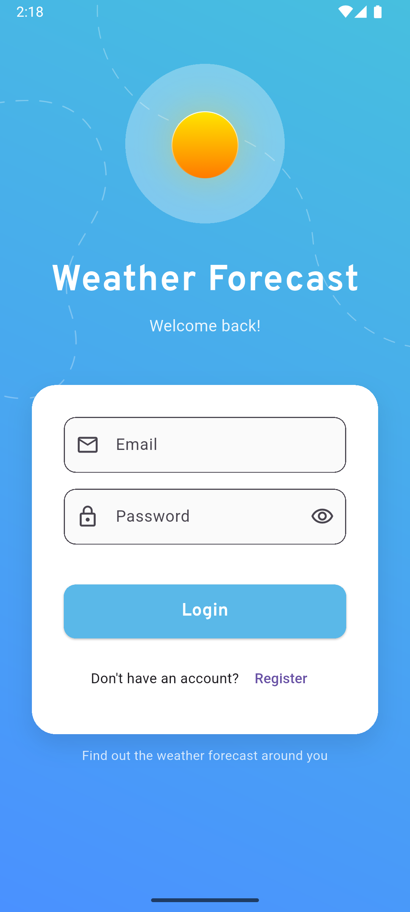 | 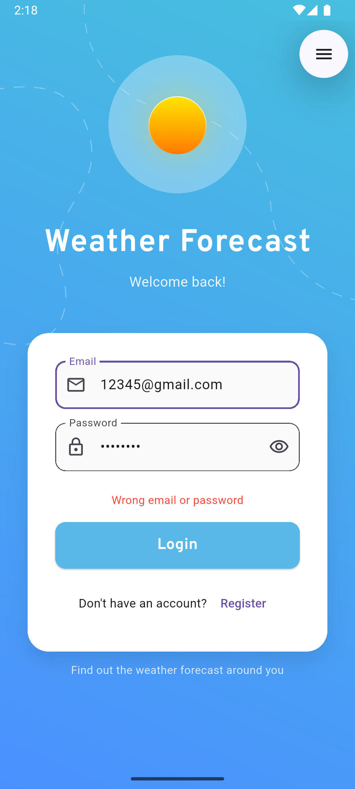 | 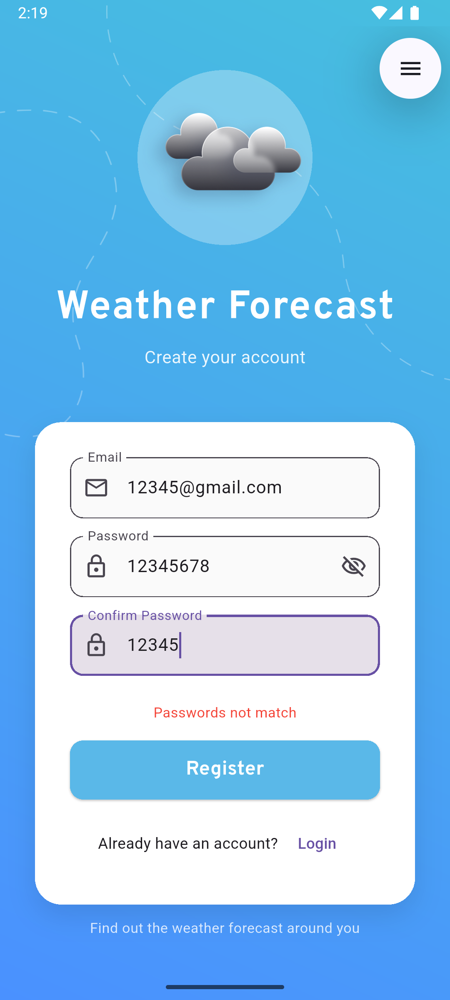 |
|--------------------------|--------------------------|--------------------------|
| 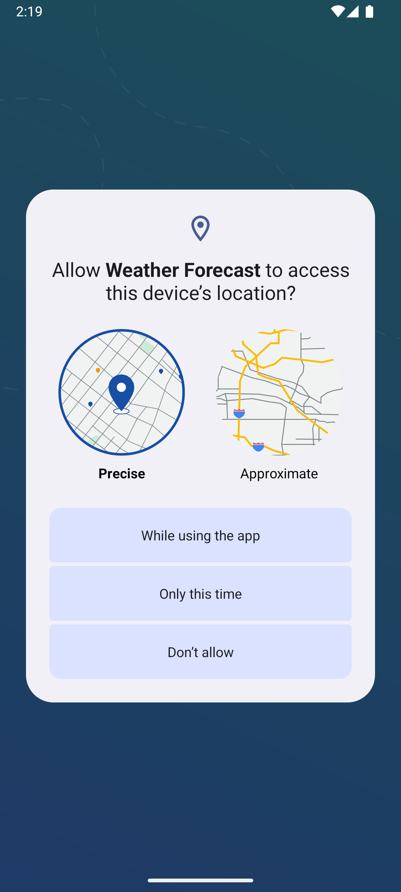 | 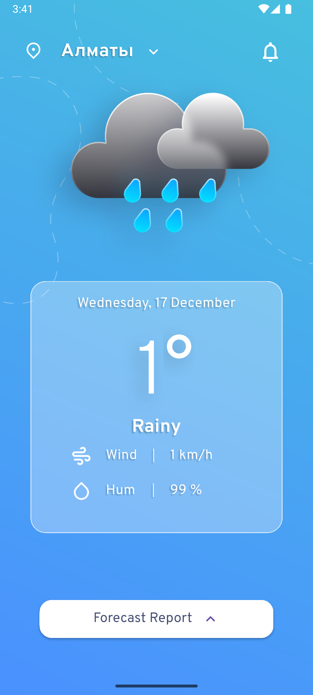 | 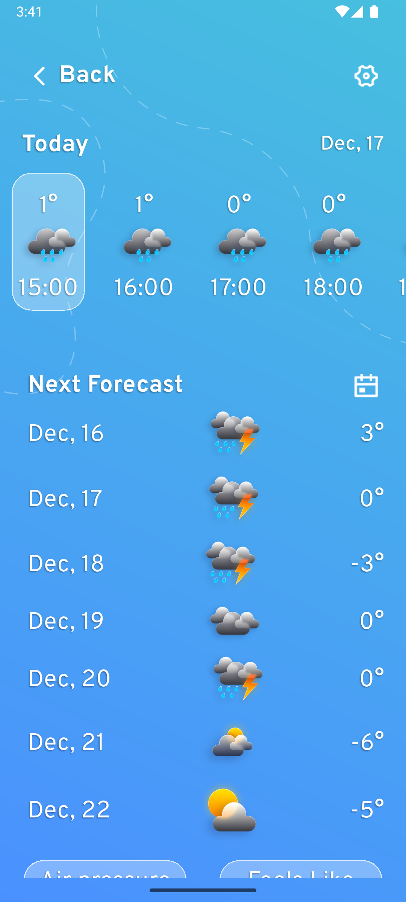 |
| 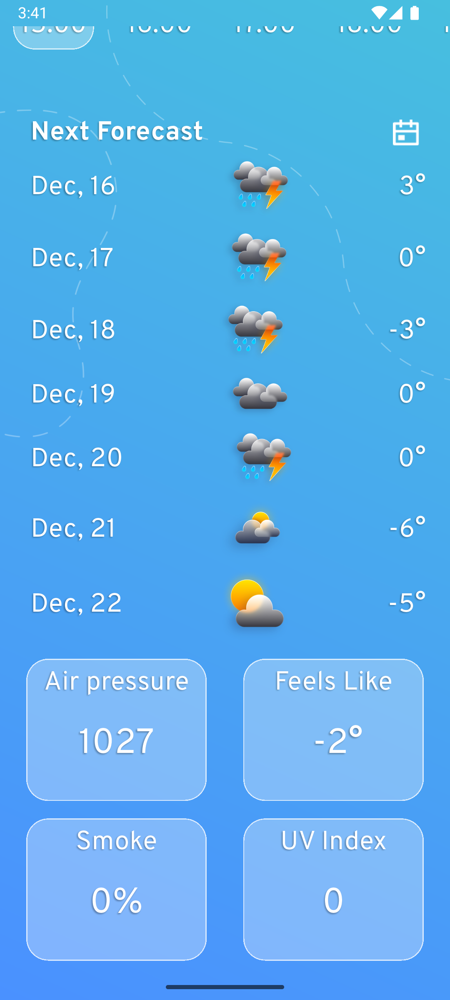 | 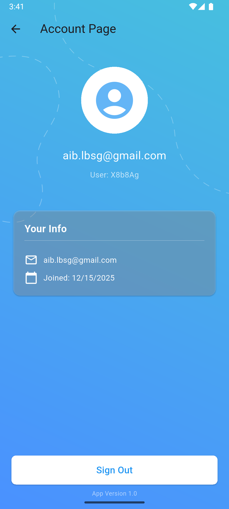 | 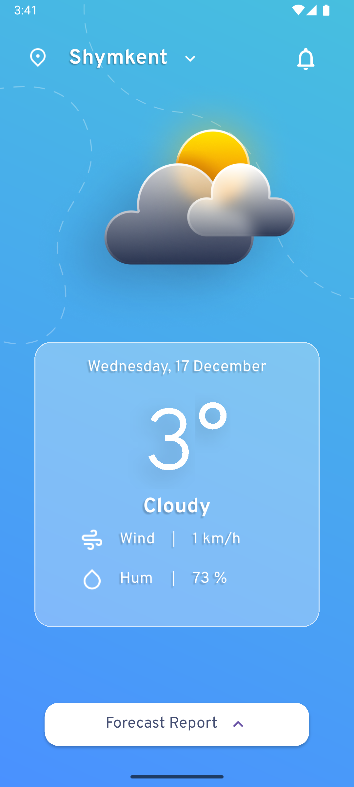 |
| 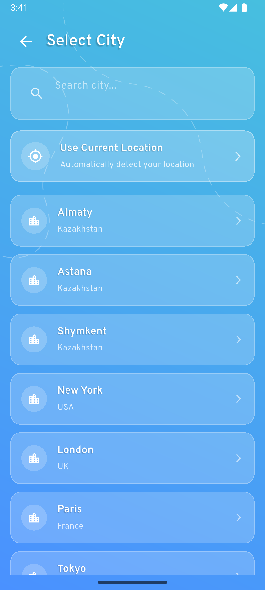 |  | 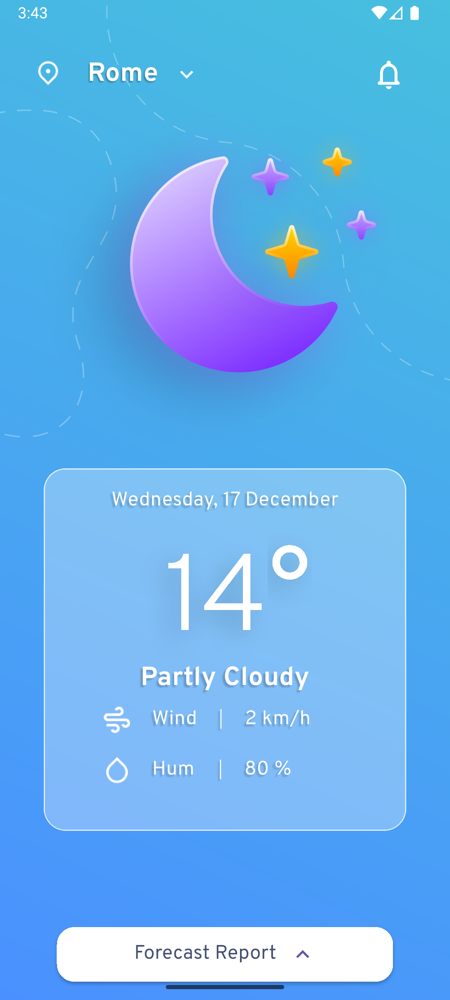 |

---

## How It Works

1. User registers or logs in using email and password
2. App asks for GPS permission
3. Location is obtained using latitude and longitude
4. Weather data is requested from Pirate Weather API
5. Data is displayed in the app
6. User can search for cities or use current location
7. User can log out from the account page

---

## Platform

- Android (mostly)
- iOS  
(Built using Flutter)

---

## Project Deliverables

- Fully working Flutter application
- Source code with organized structure
- Firebase authentication
- Weather API integration
- Presentation and documentation
- AAB / APK file shared via link

---

## Challenges

- Handling location permissions
- Parsing API responses
- Managing authentication state

These were solved by proper permission handling, testing, and Firebase integration.

---

## Conclusion

This project helped me gain experience in Flutter development, API usage, Firebase authentication, and building a real mobile application.  
The Weather Forecast app meets the capstone project requirements and works as intended.

---

Author: Ayazgaliyev Aibek 
Course: Mobile App Development (Capstone Project)  
Year: 2025
