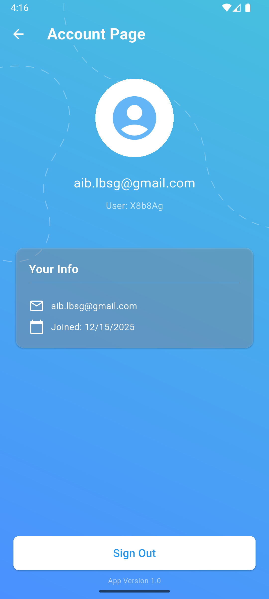

# weather_app_final

Simple weather forecast app built with Flutter.

Uses Firebase for authentication and Pirate Weather API for weather data.
Made as a capstone / pet project to practice Flutter, APIs, and Firebase.

Not production-ready.

---

## What the app does

- login / register with email + password (Firebase Auth)
- account page with logout
- asks for GPS permission
- gets current location weather
- manual city search
- shows:
  - current temperature
  - humidity
  - wind speed
  - hourly forecast (up to ~24 hours)
  - 7-day forecast
  - UV index
  - air pressure
  - smoke intensity

---

## Tech used

- Flutter (Dart)
- Firebase Authentication
- Pirate Weather API
- geolocator / geocoding
- http
- intl
- Material Design

Font:
- Overpass (full family)

---

## How it works (short)

1. user logs in or registers
2. app asks for location permission
3. gets latitude / longitude
4. sends request to Pirate Weather API
5. parses response and updates UI
6. user can switch cities or log out

---

## Screenshots

All screenshots are from real app states.

|  |  |  |
|------------------------------------|------------------------------------|------------------------------------|
|  |  |  |
|  |  |  |
|  |  |  |

---

## Project notes

- no offline mode
- no caching
- no notifications
- error handling is basic
- UI can be improved

Works fine for learning purposes.

---

## Build / run

Flutter SDK: ^3.9.2

Before running:
- setup Firebase project
- enable email/password auth
- add Pirate Weather API key

---

Author: Ayazgaliyev Aibek  
Year: 2025
